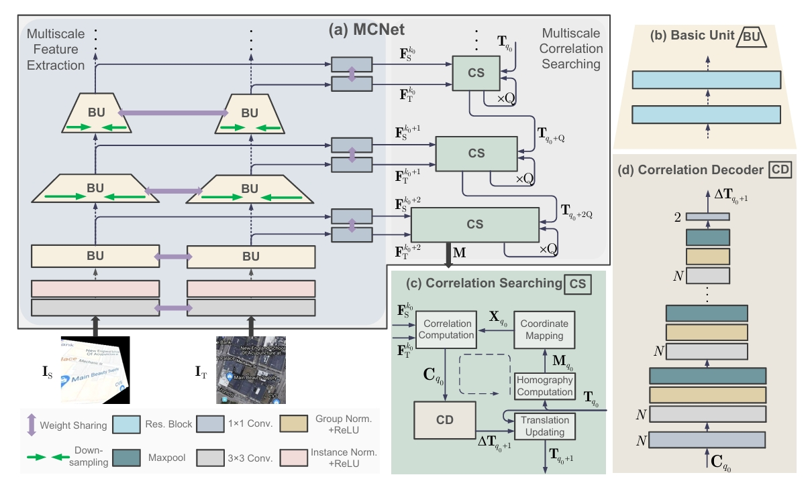
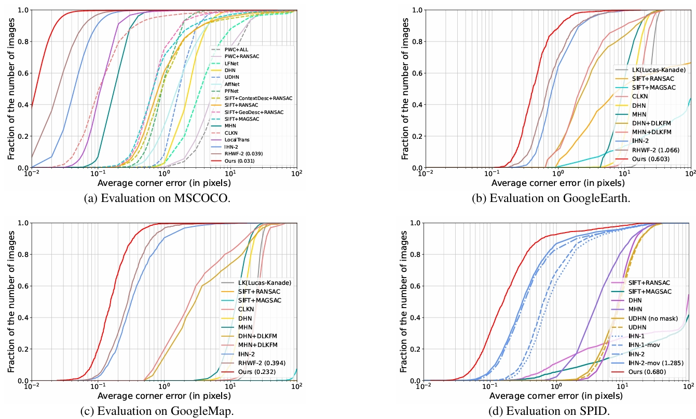
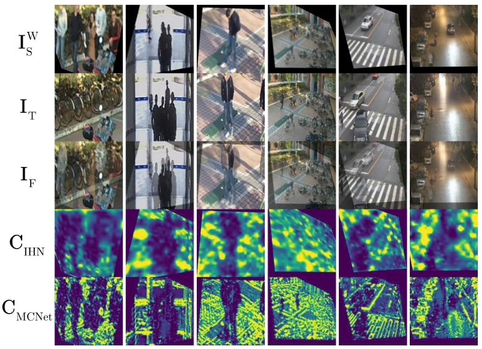
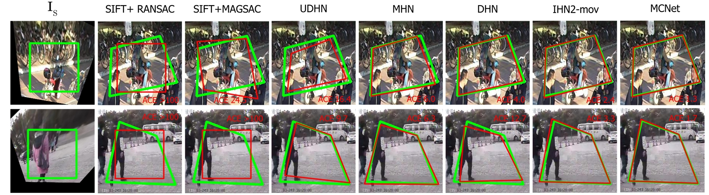

Here's the refined English README based on your paper and requirements:

---

# CVPR2024 - MCNet: Rethinking the Core Ingredients for Accurate and Efficient Homography Estimation

[](LICENSE)  
[](https://www.python.org/)  
[](https://pytorch.org/)

Official implementation of **MCNet** from the paper:  
**"MCNet: Rethinking the Core Ingredients for Accurate and Efficient Homography Estimation"**  
*(CVPR 2024)*  

## 📌 Table of Contents
- [📌 Table of Contents](#📌-table-of-contents)
- [🚀 Introduction](#🚀-introduction)
- [📦 Environment Setup](#📦-environment-setup)
- [💾 Dataset Preparation](#💾-dataset-preparation)
- [💻 Quick Start](#💻-quick-start)
- [📊 Experimental Results](#📊-experimental-results)
- [🔍 Visualization](#🔍-visualization)
- [📚 Citation](#📚-citation)
- [📧 Contact](#📧-contact)

---

## 🚀 Introduction

MCNet is a multiscale correlation searching network designed for efficient and accurate homography estimation. It achieves state-of-the-art performance with significant reductions in computational cost compared to previous methods. Key innovations include:

1. **Multiscale Correlation Searching**: Combines multi-scale strategies with iterative correlation searching to improve accuracy with minimal resource growth.
2. **Fine-Grained Optimization (FGO) Loss**: Dynamically adjusts training gradients during convergence, improving precision without extra overhead.
3. **Cross-Modality Evaluation**: Evaluation across different datasets and modalities (GoogleEarth, GoogleMap, MSCOCO, SPID) shows the effectiveness of the network in different scenarios.

<p align="center">

</p>

---

## 📦 Environment Setup

Our implementation has been successfully tested on NVIDIA RTX4090/3090/2080/8000 GPU platfroms.
Recommended setup using Anaconda:

```bash
# Create and activate environment
conda create -n mcnet python=3.8
conda activate mcnet

# Install dependencies
# refer to https://pytorch.org/get-started/previous-versions/
pip install torch==1.10.1+cu111 torchvision==0.11.2+cu111 -f https://download.pytorch.org/whl/cu111/torch_stable.html
pip install numpy opencv-python matplotlib cupy==10.6 
```

---

## 💾 Dataset Preparation

Supported datasets: MSCOCO, GoogleEarth, GoogleMap, SPID and any other personal dataset. Follow these steps:

1. Download datasets.
2. Configure dataset paths in `datasets.py`:
---

## 💻 Quick Start

### Training
```bash
python train.py --gpuid 0 --dataset mscoco --batch_size 16
```

### Testing
```bash
python test.py \
    --gpuid 0 \
    --dataset mscoco \
    --checkpoints ./weights/mscoco.pth
```

### Pretrained Weights
| Dataset         | Weight File        | 
|-----------------|--------------------|
| MSCOCO          | weights/mscoco.pth     | 
| GoogleEarth     | weights/ggearth.pth    | 
| GoogleMap       | weights/ggmap.pth      | 
| SPID            | weights/spid.pth       | 

---

## 📊 Experimental Results

### Main Metrics Comparison
| Method               | MACE ↓ | Inference Time(ms) ↓ | Params(M) ↓ |
|----------------------|--------|---------------------|-------------|
| IHN (2-scale)        | 0.060  | 60.1                | 1.71        |
| RHWF (2-scale)       | 0.039  | 157.1               | 1.29        |
| **MCNet**            | **0.031** | **33.1**           | **0.85**    |

---

## 🔍 Visualization

### MACE Comparison
<p align="left">

</p>

### Feature Map Comparison For Dynamic Scenes
<p align="left">

</p>

### Estimated Homography Comparison (SPID for reference)
<p align="left">

</p>


## 📚 Citation

If this work helps your research, please cite:

```bibtex
@inproceedings{zhu2024mcnet,
  title={Mcnet: Rethinking the core ingredients for accurate and efficient homography estimation},
  author={Zhu, Haokai and Cao, Si-Yuan and Hu, Jianxin and Zuo, Sitong and Yu, Beinan and Ying, Jiacheng and Li, Junwei and Shen, Hui-Liang},
  booktitle={Proceedings of the IEEE/CVF Conference on Computer Vision and Pattern Recognition},
  pages={25932--25941},
  year={2024}
}
```

---

## 📧 Contact

- **Haokai Zhu**: hkzhu.zju@gmail.com  
- **Si-Yuan Cao**: cao_siyuan@zju.edu.cn  

